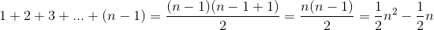

# 동명이인을 찾는 알고리즘

1. 첫 번째 자료와 뒤에 있는 자료들을 차례로 비교
2. 같은 자료가 있을 경우 저장
3. 두 번째 자료와 뒤에 있는 자료를 비교
	* 앞에 있는 자료는 이미 비교함
4. 마지막 자료는 비교할 필요 없음
	* 이미 앞에서 비교했기 때문


*  이번에 비교할 이름을 뽑은 다음에는 뽑은 이름보다 순서상 뒤에 있는 이름하고만 비교하면 된다.
*  자기 자신과 비교하는 것은 무의미하고 앞에 있는 이름과는 이미 비교가 끝났기 때문이다.
*  리스트의 마지막 이름을 기준으로는 비교허지 않아도 된다.
* 자신의 뒤에는 비교할 이름이 없고, 앞과는 이미 비교가 끝났기 때문
* 같은 이름을 찾으면 결과 집합에 그 이름을 추가

```
def find_same_name(a):
    n = len(a)                     # 인자로 받은 리스트의 길이를 n에 저장
    result = set()                 # return할 자료형은 set
    for i in range(0, n-1):        # 처음부터 n-2까지 반복(마지막은 검사할 필요가 없기때문)
        for j in range(i+1, n):    # i 다음 자료부터 마지막까지 순회
            if a[i] == a[j]:       # 리스트의 i번째 자료와 j번째 자료가 같다면(동명이인 이라면)
                result.add(a[i])   # result에 그 이름을 추가
    return result
    
 name = ['tom','jerry','mike','tom']
 print(find_same_name(name))
 
 ===실행 결과===
 {'tom'}
```

##### 알고리즘 분석

같은 이름을 찾는 알고리즘이므로 두 이름이 같은지 `비교`하는 횟루를 따져 보면 된다.

먼저 n = 4일 때 비교 횟수

위치|이름|비교 횟수|비교 대상
|:---:|---|:---:|---|
|0|Tom|3|Jerry,Mike,Tom|
|1|Jerry|2|Mike,Tom|
|2|Mike|1|Tom|
|3|Tom|0|비교 안함|

`전체 비교 횟수 = 3 + 2 + 1 + 0 = 6`

일반 적인 입력 크기인 n에 대해 알아보자

* 0번 위치 이름: n-1번 비교(자기 자신을 제외한 모든 이름과 비교)
* 1번 위치 이름: n-2번 비교(자기 자신과, 자기 자신의 앞에 있는 이름을 제외)
* 2번 위치 이름: n-3번 비교

 ...
 
* n-2번 위치 이름 : 1번 비교
* n-1번 위치 이름 : 0번 비교 


* 전체 비교 횟수는 0 + 1 + 2 + 3 + 4 + ... + (n-1)번, 즉 1부터 n-1까지의 합  
* 문제 1에서 배운 1부터 n까지의 합을 구하는 공식에 n대신 n-1을 대입하면 다음과 같다.

 

* 대문자 O 표기법으로는 O(n**2)이라고 표현한다.
* n의 제곱에 비레해서 계산 시간이 변하는 것이 핵심이므로 n2앞의 계수들은 무시하고 O(n**2)으로 표현한 것
* 복잡도가 O(n**2)인 알고리즘은 입력 크기 n이 커지면 계산 시간은 그 제곱에 비레하므로 엄청난 차이로 증가한다.


